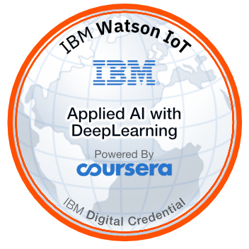
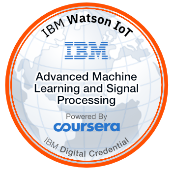
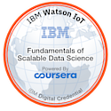
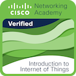

## Hi, I`m Belit

### 🎓 4th year Computer Engineering student at Beykent University. Interested in robotics and automation.

#### Skills:
                 

### 🌱 I’m currently Studying: Drone Automation & Targeting
### 📫 How to reach me:

### ⚡ Badges:

        

### 🏆 Trophies:

